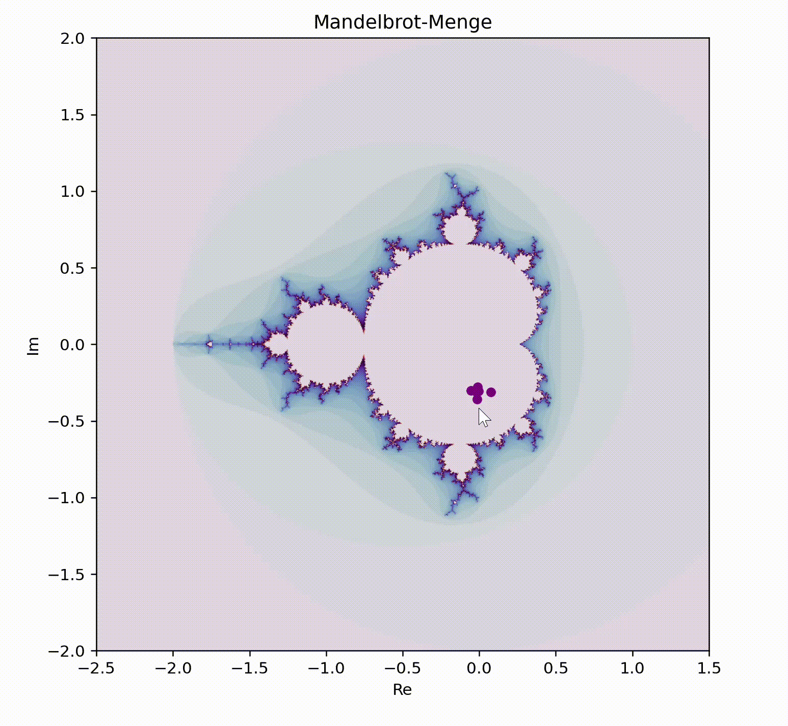

# Mandelbrot-Menge

Das Skript visualisiert die **Mandelbrot-Menge**, dabei wird eine **Folge von Punkten an der Mauposition** angezeigt. Konvergiert die Folge, so liegt der Punkt innerhalb der Mandelbrot-Menge; divergiert die Folge, so befindet sich der Punkt außerhalb der Menge. Während du die Maus bewegst, werden die berechneten Punkte in Echtzeit angepasst, sodass du die Menge interaktiv erkunden kannst.

# Definition
Eine komplexe Zahl $$c$$ ist teil der Mandelbrot-Menge, wenn die Iteration der Funktion

$$
z_{n+1} = z_n^2 + c
$$

mit dem Anfangswert $$z_0 = 0$$ **nicht** divergiert, d.h., $$|z_n|$$ bleibt für alle $$n$$ endlich, wenn $$n \to \infty$$. Andernfalls liegt der Punkt außerhalb der Mandelbrot-Menge, wenn die Folge divergiert.

Weitere Informationen auf [Wikipedia Mandelbrot-Menge](https://de.wikipedia.org/wiki/Mandelbrot-Menge).

